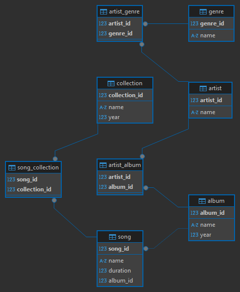

# Выборка данных

Запросы для создания БД: [create_db.sql](./creating_db/create_db.sql).

1. Заполнение базы данных (INSERT-запросы): [mus_script_1.sql](./mus_script_1.sql)

2. Выборка данных (SELECT-запросы с комментариями): [mus_script_1.sql](./mus_script_2.sql)

    #### Задание 2
    1. Название и продолжительность самого длительного трека.
    2. Название треков, продолжительность которых не менее 3,5 минут.
    3. Названия сборников, вышедших в период с 2018 по 2020 год включительно.
    4. Исполнители, чьё имя состоит из одного слова.
    5. Название треков, которые содержат слово «мой» или «my».

    #### Задание 3
    1. Количество исполнителей в каждом жанре.
    2. Количество треков, вошедших в альбомы 2019–2020 годов.
    3. Средняя продолжительность треков по каждому альбому.
    4. Все исполнители, которые не выпустили альбомы в 2020 году.
    5. Названия сборников, в которых присутствует конкретный исполнитель (выберите его сами).

    #### Задание 4
    1. Названия альбомов, в которых присутствуют исполнители более чем одного жанра.
    2. Наименования треков, которые не входят в сборники.
    3. Исполнитель или исполнители, написавшие самый короткий по продолжительности трек, — теоретически таких треков может быть несколько.
    4. Названия альбомов, содержащих наименьшее количество треков.